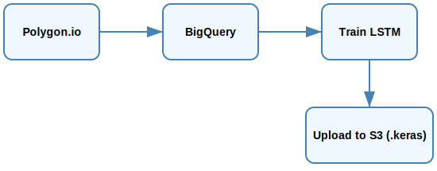

# 📊 Daily Stock Fetch & Train Service

This microservice fetches daily OHLCV stock data from Polygon.io, stores it in BigQuery, trains LSTM models on historical prices, and uploads the models to Amazon S3 for use by downstream prediction services.

---

## 🚀 Features

- ✅ Fetches latest stock data for tracked tickers
- ✅ Inserts new data into BigQuery (deduplicated)
- ✅ Trains LSTM neural networks using TensorFlow
- ✅ Saves `.keras` models to disk
- ✅ Uploads trained models to S3 (versioned by date)

---

## ⚙️ Tech Stack

- **Python 3.10+**
- **TensorFlow / Keras**
- **Pandas, NumPy, Scikit-learn**
- **Google BigQuery** (data storage)
- **Amazon S3** (model storage)
- **Polygon.io API** (stock data source)
- **boto3** (AWS SDK)
- **cron / PM2** (optional scheduling)

---

## 📂 Project Structure

```
daily-stock-service/
├── src/
│   ├── app.py                # Main script (fetch + train)
│   ├── config.py             # Loads creds from AWS SSM
│   ├── daily_fetcher.py      # Polygon fetch + BigQuery insert
│   ├── model_trainer.py      # LSTM training + S3 upload
│   └── utils/                # Helper functions (optional)
├── models/                   # Saved .keras files (before upload)
└── README.md
```

---

## 🧪 Running the Service

### 1. Install Dependencies

```bash

pip install -r requirements.txt
```

### 2. Fetch + Train (full run)

```bash

python3 src/app.py
```

This will:
1. Fetch daily OHLCV data for each symbol
2. Insert data to BigQuery if not already present
3. Train LSTM model on full historical data
4. Upload model to `s3://brown-oak-stock-prediction-models/{YYYY-MM-DD}/{SYMBOL}_model.keras`

---

## 🗃️ Data Flow



---

## 🌐 Environment Requirements

- `GOOGLE_BIG_QUERY` (SSM secret path)
- `POLYGON_KEY` (SSM secret path)
- BigQuery dataset + table already created
- S3 bucket created (e.g. `brown-oak-stock-prediction-models`)
- IAM permissions for:
  - `ssm:GetParameter`
  - `s3:PutObject`
  - `s3:ListBucket`
  - `bigquery.jobs.create`, `bigquery.tables.getData`

---

## 📦 Sample Output

```bash

▶️ Processing AAPL...
✅ Inserted 1 rows for AAPL on 2025-04-19 into stock_data
✅ Model trained for AAPL
📤 Uploaded to s3://brown-oak-stock-prediction-models/2025-04-20/AAPL_lstm_model.keras
```

---

## 📅 Suggested Cron Schedule (daily @ 6pm)

```cron
0 18 * * * cd /path/to/service && python3 src/app.py >> logs/fetch-train.log 2>&1
```

Or use PM2 for managed restarts.

---

## 🧠 Future Improvements/TODO

- [ ] Make service runs on Lambda schedule daily

---

## 👤 Author

**Nguyen Bui**  
[GitHub](https://github.com/Jackbui96) • [LinkedIn](https://www.linkedin.com/in/nguyen-hk-bui)

---

## 📘 License

MIT
